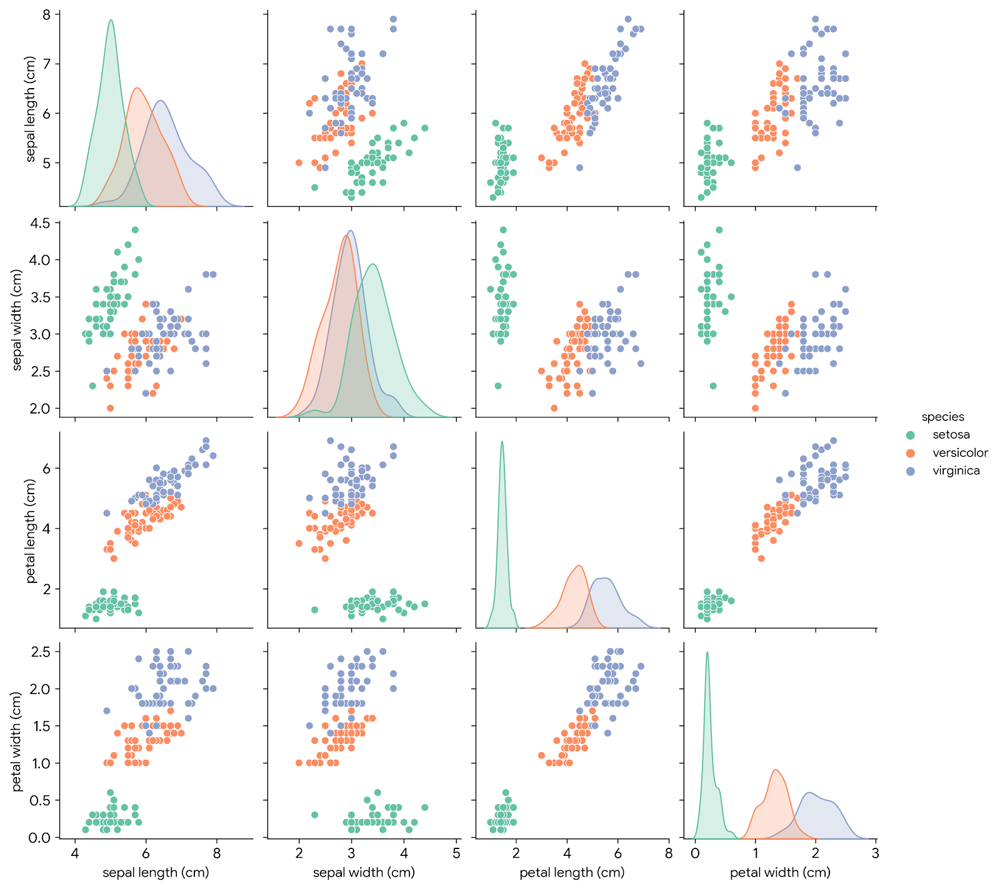

# 🚀 Enterprise AI/ML Foundations: Classification & NLP Pipelines

<p align="center">
  
  
  
  
  
  
</p>

<p align="center">
  
  
  
  
</p>

## 📖 Overview

This repository contains two foundational machine learning pipelines developed to demonstrate best practices in supervised learning, feature engineering, model evaluation, and Natural Language Processing (NLP).

The project focuses on building interpretable, efficient, and production-ready machine learning solutions while applying industry-standard methodologies for data preprocessing, training, validation, and inference.

---

## 🎯 Project Objectives

* Build a multiclass classification model using structured tabular data.
* Develop a text classification pipeline for spam detection.
* Apply feature engineering and preprocessing techniques.
* Evaluate model performance using industry-standard metrics.
* Demonstrate modular and maintainable machine learning workflows.

---

## 🏗️ Repository Structure

```text
task_01_classification_pipeline/
├── iris_model.py
├── iris_pairplot.png
├── requirements.txt

task_02_nlp_pipeline/
├── spam_classifier.py
├── dataset.csv
├── requirements.txt

README.md
```

---

## 📂 Project 1: Iris Classification Pipeline

### Problem Statement

Predict iris flower species based on sepal and petal measurements using supervised machine learning.

### Technology Stack

* Python
* Pandas
* NumPy
* Scikit-learn
* Matplotlib
* Seaborn

### Model

**Logistic Regression**

### Key Features

* Data exploration and visualization
* Feature analysis
* Train-test split
* Model training and evaluation
* Prediction pipeline

### Visualization



---

## 📂 Project 2: NLP Spam Detection Pipeline

### Problem Statement

Classify incoming text messages as spam or legitimate using Natural Language Processing techniques.

### Technology Stack

* Python
* Scikit-learn
* TF-IDF Vectorization
* Multinomial Naive Bayes

### Pipeline Components

1. Text Cleaning
2. Feature Extraction using TF-IDF
3. Model Training
4. Prediction & Evaluation

### Key Features

* Text preprocessing
* Sparse vector generation
* Probability-based classification
* Real-time message classification

---

## ⚙️ Installation

### Clone Repository

```bash
git clone https://github.com/imarpitajaiswal/QSkill-AIML-Enterprise-Pipelines.git
cd QSkill-AIML-Enterprise-Pipelines
```

### Install Dependencies

```bash
pip install -r task_01_classification_pipeline/requirements.txt
```

### Execute Classification Pipeline

```bash
python task_01_classification_pipeline/iris_model.py
```

### Execute NLP Pipeline

```bash
python task_02_nlp_pipeline/spam_classifier.py
```

---

## 📊 Learning Outcomes

* Supervised Machine Learning
* Logistic Regression
* Text Classification
* Feature Engineering
* TF-IDF Vectorization
* Naive Bayes Classification
* Model Evaluation
* Data Visualization
* Python ML Ecosystem

---

## 👩‍💻 Author

### Arpita Jaiswal

AI Engineer | Machine Learning Engineer | Generative AI Developer

Specializing in Agentic AI Systems, Retrieval-Augmented Generation (RAG), Large Language Models (LLMs), Enterprise AI Architecture, and MLOps.

### Connect

* GitHub: https://github.com/imarpitajaiswal
* LinkedIn: https://linkedin.com/in/imarpitajaiswal
* Portfolio: https://arpita-portfolio-puce.vercel.app
* Medium: https://medium.com/@imarpitajaiswal
* X: https://x.com/imarpitajaiswal
